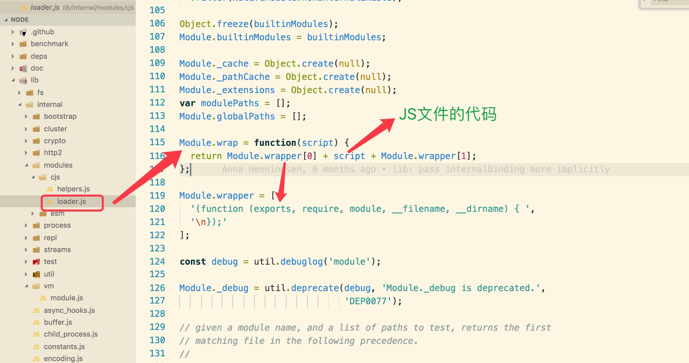
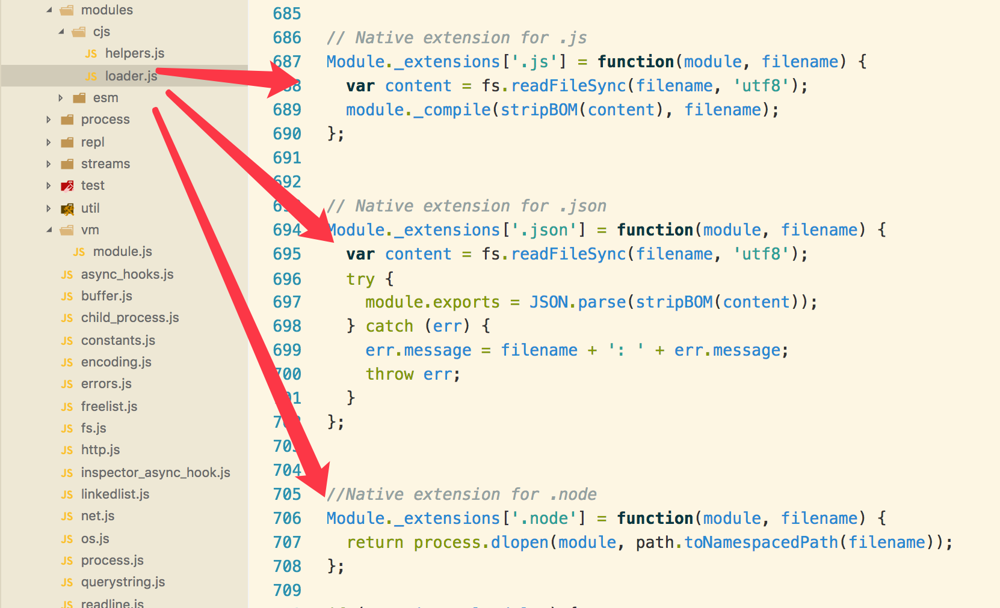

# node 模块化

JS 诞生的时候，仅仅是为了实现网页表单的本地校验和简单的 dom 操作处理。所以并没有模块化的规范设计。

项目小的时候，我们可以通过命名空间、局部作用域、自执行函数等手段实现变量不冲突。但是到了大一点的项目，各种组件，各种第三方插件和各种 js 脚步融合的时候，就会发现这些技巧远远不够。

## 模块化的演变

为什么要有 JS 模块化呢？在浏览器中，顶层作用域的变量是全局的，所以项目稍微复杂点，如果引用的 js 非常多的时候，很容易造成命名冲突，然后造成很大意想不到的结果。

为了避免全局污染，JS 前辈们想了很多办法，也就是前端的模块化的演变过程，可以参考我的视频：[前端模块化演变](https://ke.qq.com/course/276435#tuin=1eb4a0a4)

**模块化演变过程：**

* 对象封装

  * 所有的方法和属性封装到一个对象中
  * 所有的访问通过对象来访问，只污染一个对象，尽量避免污染其他。

```js
var module = {
　star : 0,
　　f1 : function ()
　　　  //...
　　},
　f2 : function (){
　　　　//...
　　}
　};
module.f1();
module.star = 1;
```

* 命名空间（对象封装的变种或者叫做升级）

  * 理论意义上减少了变量冲突
  * 缺点 1：暴露了模块中所有的成员，内部状态可以被外部改写，不安全
  * 缺点 2：命名空间会越来越长

  ```js
  var Shop = {}; // 顶层命名空间
  Shop.User = {}; // 电商的用户模块
  Shop.User.UserList = {}; //用户列表页面模块。
  Shop.User.UserList.length = 19; // 用户一共有19个。
  ```

* 私有空间

  * 私有空间的变量和函数不会影响全局作用域
  * 公开公有方法，隐藏私有属性

  ```js
  // => 给单个文件里面定义的局部变量都 变成 局部作用域里面的变量。
  // 第二个尝试：
  // a.js
  (function() {
    var a = 9;
  })();

  // b.js
  (function() {
    var a = 'ssss';
  })();
  ```

- 模块的维护和扩展

  * 开闭原则
  * 可维护性好

  ```js
  // laoma.core.js
  (function(w, d1, d2) {
    // 判断laoma框架是否存在，不存在初始化一下。
    if (!w.laoma) w.laoma = {};
    w.laoma.Btn = {
      getVal: function() {
        console.log('val');
      },
      setVal: function(str) {
        console.log('setvale');
      }
    };
  })(window || {}, depend1, depend2);

  // laoma.animate.js
  // 动画组件
  (function(w, d1, d2) {
    if (!w.laoma) {
      w.laoma = {};
    }
    w.laoma.animate = {};
  })(window || {}, depend1, depend2);

  // laoma.form.js
  // 表单组件
  (function(w, d1, d2) {
    if (!w.laoma) {
      w.laoma = {};
    }
    w.laoma.form = {};
  })(window || {}, depend1, depend2);
  ```

后续的演变就是，出现了 AMD、CMD、CommonJS 等模块化标准，然后前端模块化进入大爆发时代。

## 什么是 JS 模块化

JS 模块化就是指 JS 代码分成不同的模块，模块内部定义变量作用域只属于模块内部，模块之间变量命名不会相互冲突。各个模块相互独立，而且又可以通过某种方式相互引用协作。

## 模块化的标准

目前前端流行的几个模块化标准：[CommonJs](http://wiki.commonjs.org/wiki/Modules/1.1)标准（node 的方案）、[AMD](https://github.com/amdjs/amdjs-api/wiki/AMD)、[CMD](https://github.com/cmdjs/specification/blob/master/draft/module.md)、ES6 模块方案。

未来的趋势肯定是 ES6 的标准方案会逐渐统一。但是 AMD、CMD 标准跟 CommonJs 的标准相差不大，需要我们都研究一下。

## requirejs 入门

requirejs 的使用：

第一步：[requirejs 下载](http://requirejs.org/docs/download.html)

第二步： 把 requirejs 直接引入到 html

`<script src="js/require.js"></script>`

第三步： 设置当前页面的 js 入口文件

`<script src="js/require.js" data-main="js/main"></script>`

data-main 属性的作用是，指定网页程序的主模块。意思是当前整个网页的入口代码。那么其他需要引用的 JS 文件呢？

第四步： 引用其他模块的文件

主模块依赖于其他模块，这时就要使用 AMD 规范定义的的 require()函数。

```js
// main.js
require(['moduleA', 'moduleB', 'moduleC'], function(moduleA, moduleB, moduleC) {
  // some code here
});
```

require()函数接受两个参数。第一个参数是一个数组，表示所依赖的模块，上例就是['moduleA', 'moduleB', 'moduleC']，即主模块依赖这三个模块；第二个参数是一个回调函数，当前面指定的模块都加载成功后，它将被调用。加载的模块会以参数形式传入该函数，从而在回调函数内部就可以使用这些模块。

require()异步加载 moduleA，moduleB 和 moduleC，浏览器不会失去响应；它指定的回调函数，只有前面的模块都加载成功后，才会运行，解决了依赖性的问题。

实际应用例子：

```js
require(['jquery', 'underscore', 'backbone'], function($, _, Backbone) {
  // some code here
});
```

如果依赖的 JS 文件跟我们的 require.js 不在相同的目录，那么需要我们单独设置一下路径映射关系。

```js
require.config({
  paths: {
    underscore: 'lib/underscore.min',
    backbone: 'lib/backbone.min'
  }
});
```

第五步：如何自定义 AMD 模块（可选）

自定义的模块还依赖其他模块，那么 define()函数的第一个参数，必须是一个数组，指明该模块的依赖性

```js
define(['myLib'], function(myLib) {
  function foo() {
    myLib.doSomething();
  }
  return {
    foo: foo
  };
});
```

## CMD 与 Sea.js

[Sea.js]在推广过程中逐渐形成了 CMD 的模块定义标准。具体详情请[参考](https://www.cnblogs.com/jiangxiaobo/p/5587234.html)。

跟 AMD 比较类似，而且兼容 CommonJS 的模块写法。

CMD 推崇的是：依赖就近依赖，AMD 则默认约束模块一开始就声明相关依赖。其他定义方式及模块相关的变量都很相似。

由于 Sea.js 官方文档很详细，在此就不再赘述。如何使用请参考[官网](https://seajs.github.io/seajs/docs/)。

## Node 的模块化

Node.js 有一个简单的模块加载系统，遵循的是 CommonJS 的规范。 在 Node.js 中，文件和模块是一一对应的（每个文件被视为一个独立的模块）。

Node 在加载 JS 文件的时候，自动给 JS 文件包装上定义模块的头部和尾部。

```js
// nodejs 会自动给我们的js文件添加头部，见下行
(function(exports, require, module, __filename, __dirname) {
  // 这里是你自己写的js代码文件
}); // 自定添加上尾部
```

见 NodeJs 的源码截图：



Node会自动给js文件模块传递的5个参数，每个模块内的代码都可以直接用。而且您也看到了，我们的代码都会被包装到一个函数中，所以我们的代码的作用域都是在这个包装的函数内，这点跟浏览器的window全局作用域是不同的。

模块内的参数说明：

* __dirname： 当前模块的文件夹名称
* __filename： 当前模块的文件名称---解析后的绝对路径。
* module: 当前模块的引用，通过此对象可以控制当前模块对外的行为和属性等。
* require：是一个函数，帮助引入其他模块.
* exports：这是一个对于 module.exports 的更简短的引用形式，也就是当前模块对外输出的引用。

### 如何加载模块

在模块内，我们可以通过require函数（此函数由nodejs自动传入，在模块内可以直接用）来加载js文件模块、node内置模块等。require函数需要传入要加载的模块的名字或者是文件名或者目录。

```js
/*
假设开发目录下有文件：
.
├── circle.js
└── main.js
*/

// circle.js
exports.pi = 3.1415926;  // 其他模块引用当前模块时，可以直接通过模块对象访问到 pi属性。

// 主文件main.js：
const circle = require('./circle.js'); // 加载circle.js文件的module.export 赋值给circle
console.log(circle.pi); // => 3.1415926
```

解释：   
require加载文件circle.js后，此文件被node拼装成模块的代码，然后执行文件里面的js代码，并把模块内的module.exports做为模块的对外接口返回给引用者。

```js
// circle.js 包装后的代码就是
// nodejs 会自动给我们的js文件添加头部
(function(exports, require, module, __filename, __dirname) {
  exports.pi = 3.1415926;
  // exports  === modeule.exports
}); // 自定添加上尾部

// 主文件main.js：
const circle = require('./circle.js'); 
circle =>  circle.js中的module.exports 
```


### 加载策略

Node.js的模块分为两类，一类为原生（核心）模块，一类为文件模块。

1. 模块在第一次加载后会被缓存。 这也意味着如果每次调用 require('foo') 都解析到同一文件，则返回相同的对象。

2. Node.js提供了一些底层的核心模块，它们定义在 Node.js 源代码的 lib/ 目录下。这些原生模块在Node.js源代码编译的时候编译进了二进制执行文件，加载的速度最快。开发人员自定义的js文件是动态加载的，加载速度比原生模块慢，这个只是在第一次加载有区别，模块加载完后都会被缓存，后续使用就不会被再次加载。

3. require() 总是会优先加载核心模块。 例如，require('http') 始终返回内置的 HTTP 模块，即使有同名文件。


文件模块中，又分为3类模块。这三类文件模块以后缀来区分，Node.js会根据后缀名来决定加载方法。

* .js。通过fs模块同步读取js文件并编译执行。
* .node。通过C/C++进行编写的Addon。通过dlopen方法进行加载。
* .json。读取文件，调用JSON.parse解析加载。

参考源码：


### 模块加载逻辑

require方法接受以下几种参数的传递：

* http、fs、path等，原生模块。
* ./mod或../mod，相对路径的文件模块。
* /pathtomodule/mod，绝对路径的文件模块。
* mod，非原生模块的文件模块。

文件加载的逻辑还是比较复杂的，而且考虑很多种情况。
require加载文件模块，直接找对应完整文件名最快，如果不给文件后缀名，node会自动尝试添加 `js\json\mod`等后缀进行尝试。当没有以 '/'、'./' 或 '../' 开头来表示文件时，这个模块必须是一个核心模块或加载自 node_modules 目录。如果给定的路径不存在，则 require() 会抛出一个 code 属性为 'MODULE_NOT_FOUND' 的 Error。
如果加载目录，又分三种情况：
第一种方式是在根目录下创建一个 package.json 文件，并指定一个 main 模块。 例子，package.json 文件类似：

```js
{ 
  "name" : "some-library",
  "main" : "./lib/some-library.js"
}
```

如果这是在 ./some-library 目录中，则 require('./some-library') 会试图加载 ./some-library/lib/some-library.js。不存在也会报错。

如果目录里没有 package.json 文件，则 Node.js 就会试图加载目录下的 index.js 或 index.node 文件。 例如，如果上面的例子中没有 package.json 文件，则 require('./some-library') 会试图加载：

```
./some-library/index.js
./some-library/index.node
```

其他的情况，则从 node_modules 目录加载。 Node.js 会从当前模块的父目录开始，尝试从它的 /node_modules 目录里加载模块。 Node.js 不会附加 node_modules 到一个已经以 node_modules 结尾的路径上。

如果还是没有找到，则移动到再上一层父目录，直到文件系统的根目录。

例子，如果在 '/home/ry/projects/foo.js' 文件里调用了 require('bar.js')，则 Node.js 会按以下顺序查找：
```
/home/ry/projects/node_modules/bar.js
/home/ry/node_modules/bar.js
/home/node_modules/bar.js
/node_modules/bar.js
```
这使得程序本地化它们的依赖，避免它们产生冲突。

> 可以通过module.paths打印当前node寻找模块要搜索的所有路径。


综上逻辑，看官网的加载逻辑伪代码：

```
从 Y 路径的模块 require(X)
1. 如果 X 是一个核心模块，
   a. 返回核心模块
   b. 结束
2. 如果 X 是以 '/' 开头
   a. 设 Y 为文件系统根目录
3. 如果 X 是以 './' 或 '/' 或 '../' 开头
   a. 加载文件(Y + X)
   b. 加载目录(Y + X)
4. 加载Node模块(X, dirname(Y))
5. 抛出 "未找到"

加载文件(X)
1. 如果 X 是一个文件，加载 X 作为 JavaScript 文本。结束
2. 如果 X.js 是一个文件，加载 X.js 作为 JavaScript 文本。结束
3. 如果 X.json 是一个文件，解析 X.json 成一个 JavaScript 对象。结束
4. 如果 X.node 是一个文件，加载 X.node 作为二进制插件。结束

加载索引(X)
1. 如果 X/index.js 是一个文件，加载 X/index.js 作为 JavaScript 文本。结束
3. 如果 X/index.json  是一个文件，解析 X/index.json 成一个 JavaScript 对象。结束
4. 如果 X/index.node 是一个文件，加载 X/index.node 作为二进制插件。结束

加载目录(X)
1. 如果 X/package.json 是一个文件，
   a. 解析 X/package.json，查找 "main" 字段
   b. let M = X + (json main 字段)
   c. 加载文件(M)
   d. 加载索引(M)
2. 加载索引(X)

加载Node模块(X, START)
1. let DIRS=NODE_MODULES_PATHS(START)
2. for each DIR in DIRS:
   a. 加载文件(DIR/X)
   b. 加载目录(DIR/X)

NODE_MODULES_PATHS(START)
1. let PARTS = path split(START)
2. let I = count of PARTS - 1
3. let DIRS = []
4. while I >= 0,
   a. if PARTS[I] = "node_modules" CONTINUE
   b. DIR = path join(PARTS[0 .. I] + "node_modules")
   c. DIRS = DIRS + DIR
   d. let I = I - 1
5. return DIRS

```

总结：

我们自己加载模块的时候，尽量的写全点，尽量不要让node去推断，引用文件模块直接把文件名写全，文件

## module 对象

在每个模块中，module 的自由变量是一个指向表示当前模块的对象的引用。 为了方便，module.exports 也可以通过全局模块的 exports 对象访问。

module.exports 与 exports区别，看Node中的源码就知道了。

```js
// 模块的构造函数
function Module(id, parent) {
  this.id = id;
  this.exports = {};   // 模块实例的exports属性初始化！！！module.exports === exports
  this.parent = parent;
  updateChildren(parent, this, false);
  this.filename = null;
  this.loaded = false;
  this.children = [];
}
```

`exports` 是 `module.exports` 的一个引用，就好比在每一个模块定义最开始的地方写了这么一句代码：`var exports = module.exports`

要注意的一点就是： 最终模块会把module.exports作为对外的接口。所以，module.exports的引用地址发生了改变，在改变之前通过exports属性设置的都会被遗弃。


module的其他属性：
属性|类型|属性说明
---|---
module.filename|string|模块的完全解析后的文件名
module.id|string|模块的标识符。 通常是完全解析后的文件名。
module.loaded| boolean |模块是否已经加载完成，或正在加载中。
module.loaded| boolean |模块是否已经加载完成，或正在加载中。
module.parent| object | 最先引用该模块的模块。
module.paths|string|模块的搜索路径。
module.children|object |被该模块引用的模块对象。

详情请参考：[中文Node文档](http://nodejs.cn/api/modules.html)

## es6的模块

es6的模块引入和导出跟以上都有点区别。不过肯定是未来的统一的模型。node目前版本位置并没有es6的模块api支持的很好，只是在实验阶段。不过我们可以借助babel来转换我们的js代码，可以放心的使用。

由于这块内容，请直接参考[阮一峰老师的es6入门](http://es6.ruanyifeng.com/)


## 总结

从客户端到服务端我们都搞定了js的模块化，也就是说让js走向了工程化，大型应用的基础被奠定了。当然，目前业界模块化已经走入深水区，尤其是webpack已经可以让前端的大部分资源都模块化使用。

我们已经搞定了，自己书写模块，已经引用核心模块、自己写的模块，那么怎么引用第三方模块，怎么使用package文件，好吧提前透露一下：npm解密（下一节）

---

参考：

1.  [NodeJs 官网文档](https://nodejs.org/)
1.  [MDN 文档](https://developer.mozilla.org/zh-CN/docs/Web/JavaScript/Reference/Global_Objects)
1.  [Javascript 模块化编程（二）：AMD 规范](http://www.ruanyifeng.com/blog/2012/10/asynchronous_module_definition.html)
1.  [Javascript 模块化编程（三）：require.js 的用法](http://www.ruanyifeng.com/blog/2012/11/require_js.html)
1.  [CMD 模块定义规范](https://www.cnblogs.com/jiangxiaobo/p/5587234.html)

---

[老马免费视频教程](https://qtxh.ke.qq.com)

[返回首页](../readme.md)
